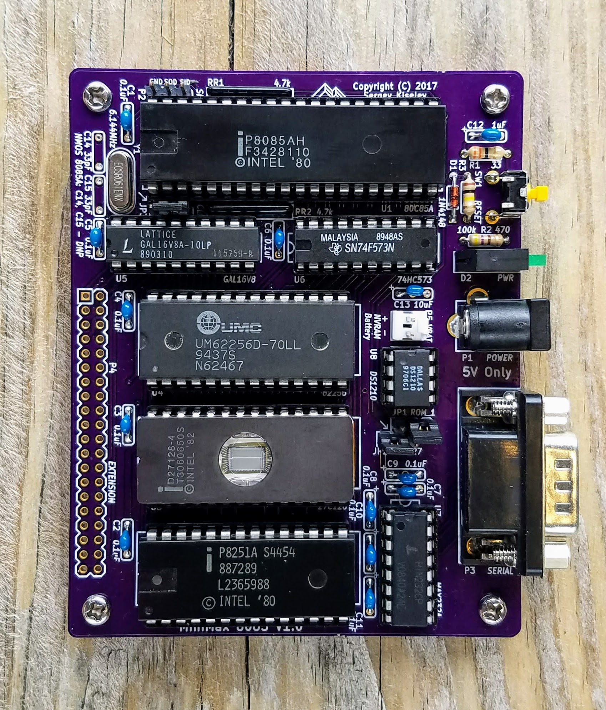
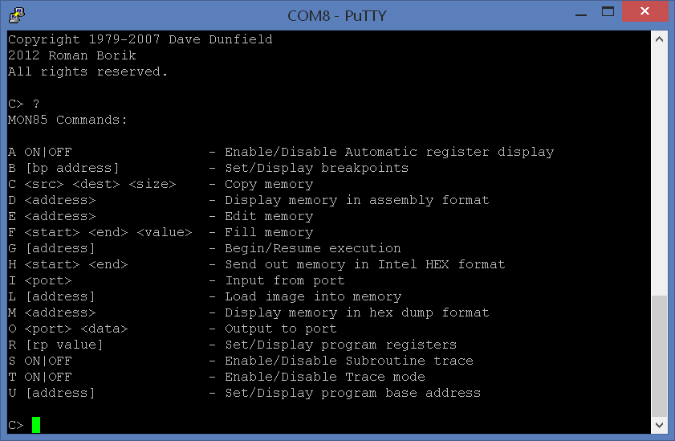
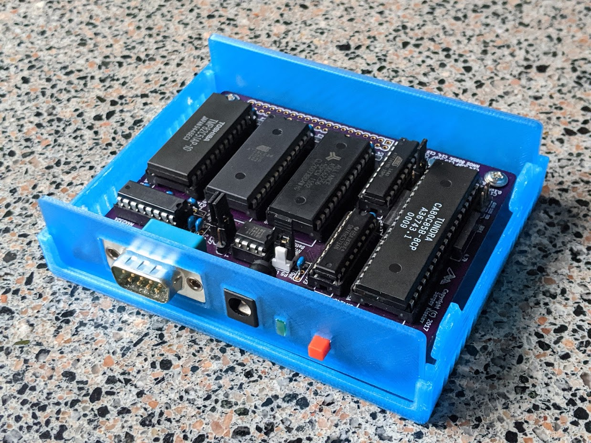

# MiniMax8085
Minimal 8085 Single Board Computer

## Table of Content
* [Introduction](#introduction)
* [Specifications](#specifications)
* [Hardware Documentation](#hardware-documentation)
  * [Schematic and PCB Layout](#schematic-and-pcb-layout)
  * [Design Description](#design-description)
  * [Jumpers and Connectors](#jumpers-and-connectors)
  * [Simple Programmable Logic Device](#simple-programmable-logic-device)
  * [Bill of Materials](#bill-of-materials)
* [Firmware and Software](#firmware-and-software)
  * [ROM Image](#rom-image)
  * [MON85 Monitor](#mon85-monitor)
  * [Tiny BASIC](#tiny-basic)
  * [IMSAI 8K BASIC](#imsai-8k-basic)
  * [Test Programs](#test-programs)
  * [Building the Software](#building-the-software)
* [3D Printable Enclosure](#3d-printable-enclosure)
* [Extension Boards](#extension-boards)
  * [Keypad and VFD Extension Board](#keypad-and-vfd-extension-board)
  * [Arithmetic and Extension Board](#arithmetic-and-extension-board)
* [Frequently Asked Questions and Troubleshooting](#frequently-asked-questions-and-troubleshooting)
* [References](#references)

## Introduction
The MiniMax8085 project has been brewing for almost three years. In the spring of 2014 my kids and I visited a local [surplus store](http://www.surplusgizmos.com/), where my kids found some Intel 8000 series parts in the kids-fill-your-bucket area. Among these ICs were there: an 8085 CPU, an 8155 RAM with I/O ports and timer, a couple of 8255 PPIs, an 8282 latch, and some 27C128 UV EPROMs. It looked like a good start for an 8085 based computer that can be used to teach my kids some computer design and programming basics.
I wanted the project to be simple to build, with a minimal number of components, but yet to be a fully functional single board computer (e.g. to include the memory and an input/output device, for example a UART) with an extension bus. I checked the Internet for existing homebrew 8085 computers and found Roman Fülek's [NCB85](http://archeocomp.blogspot.com/2013/01/ncb85.html) and [NCB85v2](http://archeocomp.blogspot.com/2014/01/ncb85-7-nove-ncb85v2.html) projects, and Glitch Works [8085 projects](http://www.glitchwrks.com/8085projects.html). While I liked these projects, they didn't quite meet my project design goals:
* [NCB85](http://archeocomp.blogspot.com/2013/01/ncb85.html) was the closest, but it doesn't have an extension bus
* [NCB85v2](http://archeocomp.blogspot.com/2014/01/ncb85-7-nove-ncb85v2.html) is a little bit too complicated for my needs
* [Glitch Works 8085](http://www.glitchwrks.com/8085projects.html) project didn't have an on-board UART

The resulting design includes 8085 CPU, 8251 USART, 32 KiB SRAM, 32 KiB or 16 KiB ROM. It uses a GAL16V8/ATF16V8 simple programmable logic device (SPLD) instead of discrete logic ICs for the address decode and the frequency divider for USART. It reduces the number of components, allows for tweaking the configuration by re-programming the SPLD, and provides an introduction to the programmable logic devices.

## Specifications
* 80C85A or 8085A CPU, 3.072 MHz, 4 MHz, 4.9152 MHz, 6.144 MHz, or 8 MHz CPU clock frequency
* 82C51A or 8251A USART for console connection
* 32 KiB of battery backed SRAM
* Up to 32 KiB of ROM. EEPROM, UV EPROM or Flash ROM memory is supported
* 40-pin extension bus connector, including most of 8085 signals and demultiplexed data and address buses

## Hardware Documentation

### Schematic and PCB Layout

[Schematic - Version 1.0](KiCad/Mini8085-Schematic-1.0.pdf)

[PCB Layout - Version 1.0](KiCad/Mini8085-Board-1.0.pdf)

### Design Description
The MiniMax8085 is based on the Intel 8085A CPU (U1). The 74*573 octal latch (U6) is used to demultiplex the lower 8-bit of address and data bus.
The board uses the Intel 8251A USART (U2) for serial input / output, for example for connecting a console. The MAX232A RS-232 driver/receiver (U7) is used to convert TTL logic levels to RS-232 voltage.
The 62256 32 KiB SRAM (U4) is used for the system RAM. The RAM is battery backed using the DS1210 NVRAM controller (U8).
The board supports a variety of ROM options (U3): The 28C256 EEPROM; UV EPROMs, such as 27C256 (32 KiB), 27C128 (16 KiB), and 27C64 (8 KiB); or The 29C256 Flash ROM ICs. Normally the ROM is mapped to the CPU memory beginning from the address *0x0000*, while the RAM is mapped beginning from the address *0x8000*. The ROM and RAM addresses can be swapped by pulling /SWAP_MEM signal low. This can be used, for example, to implement a CP/M extension card. 
The GAL16V8 simple programmable logic device (U5) implements all the required "glue" logic functions:
* Address decode and chip select for the USART. The default USART I/O address is *0x08*.
* Clock divider that divides the CPU clock to obtain USART transmit and receive clock. The divisor value depends on the CPU speed. Fuse maps with divide by 10 and 20, divide by 13 and 26, and divide by 16 and 32 ratios are provided to support common 8085A CPU clocks: 3.072 MHz, 4 MHz, 4.9152 MHz, 6.144 MHz, and 8 MHz.
* Address decode and chip select for the ROM and SRAM. The address decode logic include additional /SWAP_MEM input, which by default is configured to swap address mapping of ROM and RAM.

Please refer to the [Simple Programmable Logic Device](#simple-programmable-logic-device) section below for more details regarding the SPLD configuration and programming.

The MiniMax8085 includes a 40-pin extension connector (P4), that features the 8085A address and data buses, and control signals. Please refer to the Jumpers and Connectors section below for the connector pinout and signals description.

### Jumpers and Connectors

#### Jumpers JP1 and JP2 - ROM Configuration

These jumpers configure how pins 1 and 27 of the ROM IC (U3) are connected. The jumper settings are printed on the bottom side of the PCB.
ROM Type                   | Jumper JP1 Position - ROM Pin 1 Connection                        | JP2 Position - ROM Pin 27 Connection
-------------------------- | ----------------------------------------------------------------- | ------------------------------------
27C128, 27C64, 27128, 2764 | 2-3 - pin 1 connected to VCC                                      | 1-2 - pin 27 connected to VCC
27C256                     | 2-3 - pin 1 connected to VCC                                      | 2-JP1 pin 1 (jumper installed vertically), pin 27 connected to A14
28C256                     | 1-2 - pin 1 connected to A14                                      | 2-3 - pin 27 connected to /WR
29C256                     | 2-JP2 pin 3 (jumper installed vertically), pin 1 connected to /WR | 2-JP1 pin 1 (jumper installed vertically), pin 27 connected to A14

#### Jumper JP3 - USART Clock Frequency

JP3 sets the USART input clock frequency

Jumper Position | Crystal Y1 Frequency (CPU Frequency)                          | USART Clock Frequency | USART Bit rate
--------------- | ------------------------------------------------------------- | --------------------- | --------------
1-2             | 6.144 MHz (3.073 MHz), 8 MHz (4 MHz), 9.8304 MHz (4.9152 MHz) | 307.2 kHz             | 19200 bps (default) or 2400 bps, depending on USART configuration
1-2             | 12.288 MHz (6.144 MHz), 16 Mhz (8 MHz)                        | 614.4 kHz             | 38400 bps (default) or 4800 bps, depending on USART configuration
2-3             | 6.144 MHz (3.073 MHz), 8 MHz (4 MHz), 9.8304 MHz (4.9152 MHz) | 153.6 kHz             | 9600 bps (default) or 1200 bps, depending on USART configuration
2-3             | 12.288 MHz (6.144 MHz), 16 MHz (8 MHz)                        | 307.2 kHz             | 19200 bps (default) or 2400 bps, depending on USART configuration

#### Connector P1 - POWER

Connect regulated +5V power supply to this connector.
Pin                     | Description
----------------------- | -----------
tip (the inner contact) | Positive terminal - +5V
barrel / sleeve         | Negative terminal - ground

#### Connector P2 - SIO

Connector P2 contains the 8085A CPU serial input and output lines.
Pin | Description
--- | -----------
1   | Ground
2   | SOD / Serial Output Data
3   | SID / Serial Input Data

#### Connector P3 - SERIAL

P3 is the serial port connector. It is normally used for connecting a console or terminal. P3 uses pinout similar to that of IBM AT serial port (with some signals missing). Use a null modem cable to connect to a PC.

Pin Number | Signal Name       | Description and Notes
---------- | ----------------- | ---------------------
1          | DCD               | Carrier Detect; Not used - Not connected on the SBC
**2**      | **RX**            | **Receive Data; Input to SBC**
**3**      | **TX**            | **Transmit Data; Output from SBC**
4          | DTR               | Data Terminal Ready; Not used - Not connected on the SBC
**5**      | **Signal Ground** | **Connected to the SBC GND signal**
6          | DSR               | Data Set Ready; Not used - Not connected on the SBC
**7**      | **RTS**           | **Request to Send; Output from SBC**
**8**      | **CTS**           | **Clear to Send; Input to SBC**
9          | RI                | Ring Indicator; Not used - Not connected on the SBC
**Shield** | **DE9 Shield**    | **Connected to the SBC GND signal**

#### Connector P4 - EXTENSION

Connector P4 contains the 8085A CPU address and data buses, and control signals.

Pin | Signal    | Description                             | Pin | Signal | Description
--- | --------- | --------------------------------------- | --- | ------ | -----------
1   | TRAP      | Non-maskable interrupt input            | 21  | AD5    | Address/data bus - bit 5 bi-directional
2   | 3.073 MHz | CPU clock output                        | 22  | AD4    | Address/data bus - bit 4 bi-directional
3   | RST5_5    | RST5.5 interrupt input                  | 23  | AD7    | Address/data bus - bit 7 bi-directional
4   | INTR      | Interrupt request input                 | 24  | AD6    | Address/data bus - bit 6 bi-directional
5   | RST7_5    | RST7.5 interrupt input                  | 25  | /RD    | Read control output
6   | /INTA     | Interrupt acknowledge output            | 26  | IO/M   | I/O / memory cycle status output
7   | ALE	      | Address latch enable output             | 27  | /WR    | Write control output
8   | /SWAP_MEM | Swap ROM & RAM addresses input          | 28  | RESET  | Reset output
9   | A9        | Address bus - bit 9 output              | 29  | A1     | Address bus - bit 1 output
10  | A8        | Address bus - bit 8 output              | 30  | A0     | Address bus - bit 0 output
11  | A11       | Address bus - bit 11 output             | 31  | A3     | Address bus - bit 3 output
12  | A10       | Address bus - bit 10 output             | 32  | A2     | Address bus - bit 2 output
13  | A13       | Address bus - bit 13 output             | 33  | A5     | Address bus - bit 5 output
14  | A12       | Address bus - bit 12 output             | 34  | A4     | Address bus - bit 4 output
15  | A15       | Address bus - bit 15 output             | 35  | A7     | Address bus - bit 7 output
16  | A14       | Address bus - bit 14 output             | 36  | A6     | Address bus - bit 6 output
17  | AD1       | Address/data bus - bit 1 bi-directional | 37  | VCC    | Power - 5V
18  | AD0       | Address/data bus - bit 0 bi-directional | 38  | VCC    | Power - 5V
19  | AD3       | Address/data bus - bit 3 bi-directional | 39  | GND    | Power - Ground
20  | AD2       | Address/data bus - bit 2 bi-directional | 40  | GND    | Power - Ground

#### Connector P5 - VBAT

P5 is used to connect the battery for the SRAM backup. A 3-volt lithium cell, or 2-3 alkaline batteries connected in series can be used for this purpose.
Pin | Description
--- | -----------
1   | Battery voltage, 3V - 5V
2   | Ground

### Simple Programmable Logic Device

#### SPLD Files and Programming

As described above, the MiniMax8085 SBC uses a GAL16V8 simple programmable logic device (SPLD) to implement all the necessary glue logic. The SLPD sources and images (fuse maps are available [SPLD](SPLD/) folder of this GitHub repository:
* [Mini8085-3.072MHz.pld](SPLD/Mini8085-3.072MHz.pld) - SPLD source code for a system with CPU running on 3.072 MHz or 6.144 MHz clock frequency. 
  * [Mini8085-3.072MHz.jed](SPLD/Mini8085-3.072MHz.jed) - SPLD fuse map for a system with CPU running on 3.072 MHz or 6.144 MHz clock frequency
  * When used with 6.144 MHz CPU clock frequency, the USART clock will be doubled. So that it will work on 19200 bps instead of 9600 bps, or 38400 bps instead of 19200 bps, depending on [JP3 setting](#jumper-jp3---usart-clock-frequency)
* [Mini8085-3.9936MHz.pld](SPLD/Mini8085-3.9936MHz.pld) - SPLD source code for a system with CPU running on 3.9936 MHz (4 MHz) or 8 MHz clock frequency
  * [Mini8085-3.9936MHz.jed](SPLD/Mini8085-3.9936MHz.jed) - SPLD fuse map for a system with CPU running on 3.9936 MHz (4 MHz) or 8 MHz clock frequency
  * When used with 8 MHz CPU clock frequency, the USART clock will be doubled. So that it will work on 19200 bps instead of 9600 bps, or 38400 bps instead of 19200 bps, depending on [JP3 setting](#jumper-jp3---usart-clock-frequency)
* [Mini8085-4.9152MHz.pld](SPLD/Mini8085-4.9152MHz.pld) - SPLD source code for a system with CPU running on 4.9152 MHz clock frequency
  * [Mini8085-4.9152MHz.jed](SPLD/Mini8085-4.9152MHz.jed) - SPLD fuse map for a system with CPU running on 4.9152 MHz clock frequency

The SPLD IC has to be programmed using an EPROM programmer, such as a popular MiniPro TL866CS programmer. The process is very similar to programming regular EPROM ICs:
* Select IC manufacturer: Lattice for GAL16V8 or Atmel for ATF16V8
* Select the SPLD type: GAL16V8 or ATF16V8
* Load the SPLD fuse map - pick one of [Mini8085-3.072MHz.jed](SPLD/Mini8085-3.072MHz.jed), [Mini8085-3.9936MHz.jed](SPLD/Mini8085-3.9936MHz.jed), or [Mini8085-4.9152MHz.jed](SPLD/Mini8085-4.9152MHz.jed) files, depending on the CPU frequency (or the crystal resonator you are using).
* Program the SPLD. You might want to disable "lock" option, so that SPLD will remain readable after the programming.

#### SPLD Implementation
The [Mini8085-3.072MHz.pld](SPLD/Mini8085-3.072MHz.pld), [Mini8085-3.9936MHz.pld](SPLD/Mini8085-3.9936MHz.pld), and [Mini8085-4.9152MHz.pld](SPLD/Mini8085-4.9152MHz.pld) files contain the SPLD source code, that describes the logic equations defining the desired SPLD functionality. The source code can be divided into the following sections:

##### Header
This part contains the name of the SPLD and the project name:
<pre><code>
GAL16V8       ; 8085 SBC Logic first line : used GAL
8085Mini      ;                second line: any text (max. 8 char.)
</code></pre>

##### Pin Names Definition
This part assigns names to the SPLD pins. The names order corresponds to the pin numbers: the first line assigns names to the pins 1 - 10, and the second line to the pins 11 - 20. Note that several pins have fixed functions: pin 1 - Clock, pin 10 - GND, pin 11 - /OE, and pin 20 - VCC. Also pins 2 - 9 can be used as inputs only, while pins 12 - 19 can be used as either inputs or outputs.
<pre><code>
Clock IOM    A15    SWAPMEM A7    A6    A5    A4    A3   GND
/OE   RAMCS  ROMCS  USARTCS Q4    Q3    Q2    Q1    Q0   VCC
</code></pre>

##### Logic Equations - USART Clock Frequency Divider
The frequency divider is implemented as a synchronous counter, where all the outputs change their state simultaneously with the rising edge of the Clock signal. To achieve this, the SPLD is configured in *registered* mode (this is done automatically, by the SPLD assembler). In this mode the SPLD outputs with .R suffix (Q0.R - Q4.R) are configured as D flip-flops, and their logic equations describe the next state of the flip-flops (the values on their D inputs, that will be latched with the Clock signal). For example, in [Mini8085-4.9152MHz.pld](SPLD/Mini8085-4.9152MHz.pld) the next state of Q0 output is defined to be the inverse of its current state: Q0.R = /Q0. The Q0 - Q2 outputs are the outputs of intermediate stages of counter/divider, and they are not used in the MiniMax8085. The USART clock inputs are connected to either Q3 or Q4 output, depending on the position of the jumper JP3, resulting in divide by either 10 or 20 for 3.072 MHz CPU clock (using the [Mini8085-3.072MHz.pld](SPLD/Mini8085-3.072MHz.pld) fuse map), divide by either 13 or 26 for 4.9152 MHz CPU clock (using the [Mini8085-3.9936MHz.pld](SPLD/Mini8085-3.9936MHz.pld) fuse map), or divide by either 16 or 32 for 4.9152 MHz CPU clock (using the [Mini8085-4.9152MHz.pld](SPLD/Mini8085-4.9152MHz.pld) fuse map).

[Mini8085-4.9152MHz.pld](SPLD/Mini8085-4.9152MHz.pld): 5-bit binary counter, or divide by 32 frequency divider.
<pre><code>
Q0.R =   /Q0
 
Q1.R =    Q1 * /Q0
       + /Q1 *  Q0

Q2.R =    Q2 * /Q1
       +  Q2 * /Q0
       + /Q2 *  Q1 *  Q0

Q3.R =    Q3 * /Q2
       +  Q3 * /Q1
       +  Q3 * /Q0
       + /Q3 *  Q2 *  Q1 *  Q0

Q4.R =    Q4 * /Q3
       +  Q4 * /Q2
       +  Q4 * /Q1
       +  Q4 * /Q0
       + /Q4 *  Q3 *  Q2 *  Q1 *  Q0
</code></pre>

[Mini8085-3.072MHz.pld](SPLD/Mini8085-3.072MHz.pld): Q2-Q0 implement divide by 5 frequency divider, Q3 and Q4 stages divide the frequency further by 2 and 4 respectively.
<pre><code>
Q0.R =   /Q2 * /Q0

Q1.R =   /Q2 * /Q1 *  Q0
       + /Q2 *  Q1 * /Q0

Q2.R =   /Q2 *  Q1 *  Q0

Q3.R =    Q3 * /Q2
       + /Q3 *  Q2

Q4.R =    Q4 * /Q3
       +  Q4 * /Q2
       + /Q4 *  Q3 *  Q2
</code></pre>

#### Logic Equations - Memory Chip Select
These equations activate /ROMCS and /RAMCS signals:
The /ROMCS is active (LOW) when 8085 IO/M signal is LOW, indicating a memory access, and either A15 is LOW (lower 32 KiB of memory address space) and SWAPMEM is inactive (HIGH), or then A15 is HIGH (upper 32 KiB of memory address space), and SWAPMEM is active (LOW).
The /RAMCS is active (LOW) when 8085 IO/M is LOW, indicating a memory access, and either A15 is HIGH (upper 32 KiB of memory address space) and SWAPMEM is inactive (HIGH), or then A15 is LOW (lower 32 KiB of memory address space), and SWAPMEM is active (LOW).

<pre><code>
/ROMCS =   /IOM *  SWAPMEM * /A15
         + /IOM * /SWAPMEM *  A15

/RAMCS =   /IOM *  SWAPMEM *  A15
         + /IOM * /SWAPMEM * /A15
</code></pre>

#### Logic Equations - USART Chip Select
This equation activates the /USARTCS signal. It is active (LOW) when 8085 IO/M signal is HIGH, indicating an I/O port access, address lines A7-A4 are LOW, and address line A3 is high. So that USART is selected using  00001xxxb addresses (8h-0Fh).

<pre><code>
/USARTCS = IOM * /A7 * /A6 * /A5 * /A4 * A3
</code></pre>

### Bill of Materials

[MiniMax8085 project on Mouser.com](http://www.mouser.com/ProjectManager/ProjectDetail.aspx?AccessID=e60fdda470) - View and order all components except of the 8085A CPU, the 8251A USART, and the PCB.

[MiniMax8085 project on OSHPark.com](https://www.oshpark.com/shared_projects/CyQsELdX) - View and order the MiniMax8085 PCB.

Component Type | Reference | Description                               | Quantity | Possible Sources and Notes
-------------- | --------- | ----------------------------------------- | -------- | --------------------------
PCB            |           | MiniMax8085 PCB Version 1.0               | 1        | OSH Park [MiniMax 8085 V1.0](https://www.oshpark.com/shared_projects/CyQsELdX)
Capacitor      | C1 - C11  | 0.1 uF ceramic, 5.08 mm lead spacing      | 11       | Mouser [594-K104K15X7RF53H5](https://www.mouser.com/ProductDetail/594-K104K15X7RF53H5), [810-FG28X7R1H104KNT6](https://www.mouser.com/ProductDetail/810-FG28X7R1H104KNT6); Jameco [15270](https://www.jameco.com/z/DC-1-50-7-Jameco-Valuepro-Capacitor-Ceramic-Disc-0-1-micro-F-50V-plusmn-20-_15270.html)
Capacitor      | C12       | 1 uF ceramic, 5.08 mm lead spacing        | 1        | Mouser [810-FG28X7R1E105KRT6](https://www.mouser.com/ProductDetail/810-FG28X7R1E105KRT6)
Capacitor      | C13       | 10 uF ceramic, 5.08 mm lead spacing       | 1        | Mouser [810-FG28X5R1E106MR00](https://www.mouser.com/ProductDetail/810-FG28X5R1E106MR00). Note: Can be replaced with tantalum or electrolytic capacitors
Capacitor      | C14, C15  | 33 pF ceramic, 5.08 mm lead spacing       | 2        | Mouser [75-1C20C0G330J050B](https://www.mouser.com/ProductDetail/75-1C20C0G330J050B); Jameco [332217](https://www.jameco.com/z/DC33-50-Jameco-Valuepro-Capacitor-Ceramic-Disc-33pF-50V-plusmn20-37_332217.html).Note: Install only when using CMOS 80C85A CPU. Do not install when using NMOS 8085A
Connector      | P1        | DC jack                                   | 1        | Mouser [806-KLDX-0202-A](https://www.mouser.com/ProductDetail/806-KLDX-0202-A); Jameco [101179](https://www.jameco.com/z/GCD014-R-Jameco-Valuepro-2-1mm-Male-DC-Power-Jack-Solder-Eyelet-Terminals_101179.html), [101178](https://www.jameco.com/z/GCD014-Jameco-Valuepro-2-1mm-DC-Power-Jack-Male-Solder-Eyelet-Panel-Mount-Groove-_101178.html)
Connector      | P2, JP1 - JP3 | 3x1 pin header                        | 4        | Mouser [855-M20-9990345](https://www.mouser.com/ProductDetail/855-M20-9990345), [649-69190-103HLF](https://www.mouser.com/ProductDetail/649-69190-103HLF), [649-78229-103HLF](https://www.mouser.com/ProductDetail/649-78229-103HLF); Jameco [109576](https://www.jameco.com/z/7000-1X3SG-R-Jameco-Valuepro-Header-1-Straight-Male-1-Row-3-Pin-10-025-Post-23-Goldtail_109576.html)
Connector      | P3        | DE9M, right angle PCB mount               | 1        | Mouser [806-K22X-E9P-N-99](https://www.mouser.com/ProductDetail/806-K22X-E9P-N-99) (teal color), [806-K22X-E9P-N](https://www.mouser.com/ProductDetail/806-K22X-E9P-N); Jameco [104943](https://www.jameco.com/z/1008-9P-R-Jameco-Valuepro-Connector-D-Subminiature-Male-9-Position-2-77mm-Solder-Right-Angle-Through-Hole-9-Terminal-1-Port_104943.html), [614459](https://www.jameco.com/z/747840-6-TE-Connectivity-Connector-D-Subminiature-Plug-9-Position-2-74mm-Solder-Right-Angle-Through-Hole-9-Terminal-1-Port-Tray_614459.html), [614432](https://www.jameco.com/z/5747840-3-TE-Connectivity-Connector-D-Subminiature-Plug-9-Position-2-74mm-Solder-Right-Angle-Through-Hole-9-Terminal-1-Port_960837.html)
Connector      | P4        | 20x2 pin socket                           | 1        | Mouser [517-929852-01-20-RB](https://www.mouser.com/ProductDetail/517-929852-01-20-RB). Note: Optional, used for extension bus
Connector      | P5        | 2 pin header with friction lock           | 1        | Mouser [571-6404562](https://www.mouser.com/ProductDetail/571-6404562), [571-3-641126-2](https://www.mouser.com/ProductDetail/571-3-641126-2), [571-3-641215-2](https://www.mouser.com/ProductDetail/571-3-641215-2); Jameco [232266](https://www.jameco.com/z/22-23-2021-Molex-Connector-Wire-to-Board-Header-2-Position-2-54mm-Solder-Straight-Thru-Hole-Color-may-vary-_232266.html), [613931](https://www.jameco.com/z/640456-2-TE-Connectivity-Connector-Wire-to-Board-Header-2-Position-2-54mm-Solder-Straight-Thru-Hole_613931.html). Note: Optional, used for SRAM battery backup. Corresponding female connector: Mouser [571-13758202](https://www.mouser.com/ProductDetail/571-13758202); Jameco [234798](https://www.jameco.com/z/22-01-3027-Molex-Straight-Connector-Housing-Receptacle-2-Position-2-54mm-Color-may-vary-_234798.html). Contacts (2 contacts needed): Mouser [571-14453361](https://www.mouser.com/ProductDetail/571-14453361); Jameco [234923](https://www.jameco.com/z/08-50-0114-Molex-0-100-2-54mm-Connector-Contact-Female-1-Position-Crimp-Straight-Cable-Mount-Bag_234923.html), [736501](https://www.jameco.com/z/08-50-0113-Molex-Connector-Contact-Female-1-Position-Crimp-Straight-Cable-Mount-Reel_736501.html).  It is recommended to use a polarized header to avoid incorrect power polarity.
Diode          | D1        | 1N4148                                    | 1        | Mouser [512-1N4148TR](https://www.mouser.com/ProductDetail/512-1N4148TR), [512-1N4148](https://www.mouser.com/ProductDetail/512-1N4148), [78-1N4148](https://www.mouser.com/ProductDetail/78-1N4148); Jameco [36038](https://www.jameco.com/z/1N4148-Major-Brands-Diode-1N4148-100V-200mA-10mA-If-Small-Signal-Switching-Bulk-_36038.html), [179215](https://www.jameco.com/z/1N4148-Major-Brands-Diode-1N4148-100V-200mA-10mA-If-Small-Signal-Switching-Bulk-_36038.html)
LED            | D2        | LED Indicator, Dialight 566-0206F         | 1        | Mouser [645-566-0206F](https://www.mouser.com/ProductDetail/645-566-0206F).  Note: Can be replaced with a standard 3 mm or 5 mm LED
Resistor       | R1        | 33 Ohm, 1/4 W                             | 1        | Mouser [240-CFR-25JT-52-33R](https://www.mouser.com/ProductDetail/240-CFR-25JT-52-33R); Jameco [690507](https://www.jameco.com/z/CF1-4W330JRC-Jameco-Valuepro-Resistor-Carbon-Film-33-Ohm-5-1-4-Watt_690507.html)
Resistor       | R2        | 470 Ohm, 1/4 W                            | 1        | Mouser [603-CFR-25JT-52-470R](https://www.mouser.com/ProductDetail/603-CFR-25JT-52-470R); Jameco [690785](https://www.jameco.com/z/CF1-4W471JRC-Jameco-Valuepro-Resistor-Carbon-Film-470-Ohm-1-4-Watt-5-_690785.html)
Resistor       | R3        | 100 kOhm, 1/4 W                           | 1        | Mouser [603-CFR-25JT-52-100K](https://www.mouser.com/ProductDetail/603-CFR-25JT-52-100K); Jameco [691340](https://www.jameco.com/z/CF1-4W104JRC-Jameco-Valuepro-Resistor-Carbon-Film-100k-Ohm-1-4-Watt-5-_691340.html)
Resistor Array | RR1, RR2  | 4.7 kOhm, 6 pin, bussed resistor array    | 2        | Mouser [264-4.7K-RC](https://www.mouser.com/ProductDetail/264-4.7K-RC), [652-4606X-1LF-4.7K](https://www.mouser.com/ProductDetail/652-4606X-1LF-4.7K)
Switch         | SW1       | Tactile switch, right angle               | 1        | Mouser [653-B3F-3100](https://www.mouser.com/ProductDetail/653-B3F-3100), [653-B3F-3152](https://www.mouser.com/ProductDetail/653-B3F-3152), [706-95C06A2RAT](https://www.mouser.com/ProductDetail/706-95C06A2RAT), [706-95C06C2RAT](https://www.mouser.com/ProductDetail/706-95C06C2RAT), [706-95C06F2RAT](https://www.mouser.com/ProductDetail/706-95C06F2RAT); Jameco [2280495](https://www.jameco.com/z/SKHHLNA010-Alps-Electric-SPST-NO-OFF-MOM-Tactile-Switch-12VDC-50mA_2280495.html). Note: Switches can have different actuator length. You might want to select the switch according your own preferences, for example the enclosure type you want to use, and whatever you want the reset button to stick out of the enclosure or to stay hidden inside.
Crystal        | Y1        | 6.144 MHz quartz resonator for 3 MHz CPU; 8 MHz quartz resonator for 4 MHz CPU; 9.8304 MHz quartz resonator for 5 MHz CPU; 12.288 MHz quartz resonator for 6 MHz CPU ; 16 MHz quartz resonator for 8 MHz CPU | 1 | Mouser [520-61-18-4XEN](https://www.mouser.com/ProductDetail/520-61-18-4XEN) (6.144 MHz), [695-HC49US-983-U](https://www.mouser.com/ProductDetail/695-HC49US-983-U) (9.8304 MHz), [695-HC49US-122-U](https://www.mouser.com/ProductDetail/695-HC49US-122-U) (12.288 MHz), [815-ABL-16-B2](https://www.mouser.com/ProductDetail/815-ABL-16-B2) (16 MHz); Unicorn Electronics 6.144 MHz or 9.8304 MHz according to desired CPU clock frequency.
IC             | U1        | 80C85A, 8085A-2, or 8085A CPU             | 1        | Jameco [8085A-2, 5 MHz - 52071](https://www.jameco.com/z/8085A-2-Major-Brands-IC-8085A-2-8-Bit-CPU-32-I-O-5MHz-DIP-40-pin_52071.html), [8085A, 3 MHz - 52062](https://www.jameco.com/z/8085A-Major-Brands-IC-8085A-8-Bit-HMOS-MPU_52062.html); Unicorn Electronics 80C85, 8085A-2, or 8085A; eBay (search for 80C85 or 8085 CPUs, or IM1821VM85A / ИМ1821ВМ85А for Soviet 80C85 clone).  Note: Use CMOS part - 80C85A for lower power consumption
IC             | U2        | 82C51A, or 8251A USART                    | 1        | Jameco [8251A - 52652](https://www.jameco.com/z/8251A-Major-Brands-IC-8251A-USART-28-pin-DIP_52652.html) [82C51A - 52370](https://www.jameco.com/z/82C51A-Major-Brands-IC-82C51A-USART-CMOS-Transceiver-28-pin-DIP_52370.html), [NEC D8251AC - 52644](https://www.jameco.com/z/D8251AC-NEC-Corporation-IC-USART-8251-Dip-28_52644.html); Unicorn Electronics 82C51 or 8051; eBay (search for 82C51 or 8251 USART, or 580VV51 / 580ВВ51 for Soviet 8251 clone).  Note: Use CMOS part - 82C51A for lower power consumption
IC             | U3        | 28C256 EEPROM, 27C256 UV EPROM, 27C128 UV EPROM, 27128 UV EPROM, 27C64 UV EPROM, 2764 UV EPROM | 1 | Mouser [556-AT28C25615PU](https://www.mouser.com/ProductDetail/556-AT28C25615PU); Jameco [28C256 EEPROM - 74843](https://www.jameco.com/z/28C256-15-Major-Brands-IC-28C256-15-EEPROM-256K-Bit-CMOS-Parallel_74843.html), [27C256 UV EPROM - 39714](https://www.jameco.com/z/27C256-15-Major-Brands-IC-27C256-15-EPROM-256K-Bit-150ns-CMOS-UV-Erasable-Prommable-ROM_39714.html); Unicorn Electronics 28C256-15 (EEPROM), 27C256 or 27C128 (UV EPROM). Note: EEPROM parts are recommended. UV lamp is required to erase UV EPROMs
IC             | U4        | 62256 SRAM                                | 1        | Mouser [913-AS6C62256-55PCN](https://www.mouser.com/ProductDetail/913-AS6C62256-55PCN); Jameco [CY62256LL-70PC - 391822](https://www.jameco.com/z/CY62256LL-70PC-Cypress-Semiconductor-IC-CY62256LL-70PC-CMOS-SRAM-256k-Bit-32kx8-Asynch-70ns-Low-Power_391822.html), [CY62256L-70PC - 391793](https://www.jameco.com/z/CY62256L-70PC-Cypress-Semiconductor-IC-CY62256L-70PC-CMOS-SRAM-256K-Bit-32kx8-55-70ns-Low-Power_391793.html), [62256LP-70 - 82472](https://www.jameco.com/z/62256LP-70-Major-Brands-IC-62256LP-CMOS-SRAM-256K-Bit-32Kx8-70ns-Low-Power_82472.html), [62256LP-10 - 42833](https://www.jameco.com/z/62256LP-10-Major-Brands-Static-RAM-32K-x-8-Bit-High-Speed-CMOS-100ns-DIP-28_42833.html), [62256LP-15 - 42850](https://www.jameco.com/z/62256LP-15-Major-Brands-Static-RAM-32K-x-8-Bit-High-Speed-CMOS-150ns-DIP-28_42850.html); Unicorn Electronics 62256LP-70 (or any other 62256)
IC             | U5        | GAL16V8, ATF16V8                          | 1        | Mouser [556-AF16V8B15PU](https://www.mouser.com/ProductDetail/556-AF16V8B15PU), Jameco [GAL16V8D-15LP - 2290551](https://www.jameco.com/z/GAL16V8D-15LP-Lattice-Semiconductor-Corporation-IC-16V8D-15-High-Performance-EE-CMOS-PLD-Generic-Array-Logic-15ns-90mA-250MHz_2290551.html), [GAL16V8D-25LP - 876539](https://www.jameco.com/z/GAL16V8D-25LP-Lattice-Semiconductor-Corporation-IC-GAL16V8D-25-EECMOS-64x32-GAL-41-6MHz-20-pin-DIP_876539.html); Unicorn Electronics 16V8 (10 ns, 12 ns, or 15 ns versions would work. Make sure to contact the seller and ask specifically for Lattice GAL16V8 part. iCT PEEL16V8 parts are not supported by MiniPro TL866CS programmer)
IC             | U6        | 74HCT573, 74ALS573, 74F573                | 1        | Mouser [595-SN74HCT573N](https://www.mouser.com/ProductDetail/595-SN74HCT573N), [595-SN74AHCT573N](https://www.mouser.com/ProductDetail/595-SN74AHCT573N), [595-SN74F573N](https://www.mouser.com/ProductDetail/595-SN74F573N), [595-SN74ALS573CN](https://www.mouser.com/ProductDetail/595-SN74ALS573CN); Jameco [74HCT573 - 45090](https://www.jameco.com/z/74HCT573-Major-Brands-IC-74HCT573-Tri-State-Octal-D-type-Transparent-Latch_45090.html); Unicorn Electronics 74HCT573, 74F573, 74ALS573; eBay (search for 74HCT573, 74ALS573, 74F573, or KR1533IR33 / КР1533ИР33 for Soviet 74ALS573 clone)
IC             | U7        | MAX202,  MAX232A                          | 1        | Mouser [595-TRS202ECN](https://www.mouser.com/ProductDetail/595-TRS202ECN), [700-MAX202CPE](https://www.mouser.com/ProductDetail/700-MAX202CPE), [700-MAX232ACPE](https://www.mouser.com/ProductDetail/700-MAX232ACPE); Jameco [MAX202CPE - 142535](https://www.jameco.com/z/MAX202CPE-Major-Brands-IC-MAX202CPE-RS-232-Line-Transceiver-16-pin-DIP_142535.html); Unicorn Electronics MAX202
IC             | U8        | Maxim DS1210, or Maxim MXD1210            | 1        | Mouser [700-MXD1210CPA](https://www.mouser.com/ProductDetail/700-MXD1210CPA); Jameco [DS1210 - 114198](https://www.jameco.com/z/DS1210-Dallas-Semiconductor-IC-DS1210-Nonvolatile-Controller-8-pin-DIP_114198.html); Unicorn Electronics DS1210. Note: Optional, used for SRAM battery backup. If not populated - install two wire jumpers instead as shown on the PCB silk screen
IC Socket      | U1        | 40 pin 600 mil DIP socket                 | 1        | Mouser [517-4840-6000-CP](https://www.mouser.com/ProductDetail/517-4840-6000-CP), [649-DILB40P223TLF](https://www.mouser.com/ProductDetail/649-DILB40P223TLF); Jameco [41111](https://www.jameco.com/z/6000-40DW-R-Jameco-Valuepro-40-Pin-Dual-Wipe-Low-Profile-IC-Socket-0-60-Inch-Wide_112311.html)
IC Socket      | U2 - U4   | 28 pin 600 mil DIP socket                 | 3        | Mouser [517-4828-6000-CP](https://www.mouser.com/ProductDetail/517-4828-6000-CP), [649-DILB28P223TLF](https://www.mouser.com/ProductDetail/649-DILB28P223TLF); Jameco [40301](https://www.jameco.com/z/28LPD-6-Jameco-Valuepro-28-Pin-Dual-Wipe-Low-Profile-IC-Socket-0-6-Inch-Wide_40301.html)
IC Socket      | U5, U6    | 20 pin 300 mil DIP socket                 | 2        | Mouser [517-4820-3000-CP](https://www.mouser.com/ProductDetail/517-4820-3000-CP), [649-DILB20P-223TLF](https://www.mouser.com/ProductDetail/649-DILB20P-223TLF); Jameco [38608](https://www.jameco.com/z/20LPD-Major-Brands-20-Pin-0-3-Inch-Wide-Low-Profile-Dual-Wipe-IC-Socket_112248.html)
IC Socket      | U7        | 16 pin 300 mil DIP socket                 | 1        | Mouser [517-4816-3000-CP](https://www.mouser.com/ProductDetail/517-4816-3000-CP), [649-DILB16P-223TLF](https://www.mouser.com/ProductDetail/649-DILB16P-223TLF); Jameco [37373](https://www.jameco.com/z/ICS-316-T-Jameco-Valuepro-IC-Socket-16-Pin-Dual-Wipe-Low-Profile-0-3-Inch-Wide_112222.html)
IC Socket      | U8        | 8 pin 300 mil DIP socket                  | 1        | Mouser [517-4808-3000-CP](https://www.mouser.com/ProductDetail/517-4808-3000-CP), [649-DILB8P223TLF](https://www.mouser.com/ProductDetail/649-DILB8P223TLF); Jameco [112206](https://www.jameco.com/z/8LPD-Jameco-Valuepro-8-Pin-IC-Socket-Dual-Wipe-Low-Profile-0-30-Inch-Wide_112206.html)

#### Replacement Notes

* CMOS parts are preferred for lower power consumption.
* 80C85 (CPU) - Any type in DIP-40 package will do. Use 6.144 MHz crystal for 3 MHz parts. Such parts usually don't have any numeric suffix in the part name. For example Intel P8085AH is a 3 MHz part, while Intel P8085AH-2 is a 5 MHz part.
  * CMOS parts: MSM80C85A or M80C85A (OKI), CA80C85B (Calmos, Tundra), IM1821VM85A (Soviet/Russian Clone)
  * NMOS parts: P8085A (Intel, AMD), P8085AH, P8085AH-2, P8085AH-1 (Intel, newer HMOS process, 3 MHz, 5 MHz, and 6 MHz parts respectively), M5L8085AP (Mitsubishi), TMP8085AP (Toshiba), and so on.
* 80C51A (USART) - Any type in DIP-28 package.
* 28C256 (EEPROM, EPROM) - The board support a wide variety of ROMs. Note that JP1 and JP2 jumpers need to be set according to the ROM type.
  * 28C256 EEPROM: Atmel/Microchip AT28C256, Xicor X28C256
  * CMOS UV EPROMs: 27C256 UV EPROMs (32 KiB), 27C128 UV EPROMs (16 KiB), 27C64 UV EPROMs (8 KiB)
  * NMOS UV EPROMs: 27256 UV EPROMs (32 KiB), 27128 UV EPROMs (16 KiB), 2764 UV EPROMs (8 KiB)
  * 62256-like NVRAM (32 KiB)
  * AT29C256 Flash ROM
* 62256 (SRAM) - A low-power CMOS SRAM 32KiB, in DIP-28 wide (600 mils) packages. Here are some common parts:
  * In production: AS6C62256 (Alliance Memory), CY62256N (Cypress)
  * Old stock: HM62256LP (Hitachi), HY62256 (Hyundai), KM62256 (Samsung), UM62256 (UMC)
* GAL16V8 (SPLD): Needs to be in DIP-20 package
  * In production:  Atmel/Microchip ATF16V8
  * Old stock: Lattice GAL16V8 (any modification)
  * iCT PEEL16V8 might work, but it is not supported by common MiniPro TL866CS programmer
* 74HC573 (Octal D Latch with 3-STATE Outputs) - Can be replaced with any 74-series family that works with 5V power supply voltage. 
  * CMOS parts: 74HC573, 74ACT573, 74HCT573, 74AHCT573, 74AC573, 74ACT573
  * TTL parts: 74ALS573, 74F573, 74LS573
* MAX232A (RS-232 Drivers/Receivers) - There is a variety of compatible ICs available from various manufacturers. Note that the original MAX232 part as well as some compatible ICs require 1 uF capacitors for charge pumps (C7-C11).
  * Maxim: MAX232A, MAX202, MAX232
  * Texas Instruments: TRS202, MAX232
  * Exar: SP232
  * Analog Devices: ADM202, ADM232
  * Intersil: HIN202, HIN232
* LED D2 - Can be replaced by a 3 mm LED with pins bent at 90 degrees.

## Firmware and Software

### ROM Image

The pre-built [ROM image](software/mon85-tinybasic-8kbasic.bin) for MiniMax8085 containing, the MON85 monitor, Tiny BASIC, and IMSAI 8K BASIC is provided in this repository.
This ROM image has the following layout:
* 0x0000 - 0x0FFF - MON85 Monitor. It will run automatically upon power-on or reset
* 0x1000 - 0x17FF - Tiny BASIC. Use MON85 **G 1000** command to run it
* 0x1800 - 0x3FFF - IMSAI 8K BASIC. Use MON85 **G 1800** command to run it
The image size is 8 KiB, and it will work with either 16 KiB EPROMs (e.g. 27128), and 32 KiB EPROMs. It can be programmed into 8 KiB EPROM, leaving out the IMSAI 8K BASIC.

### MON85 Monitor

MiniMax8085 uses MON85 Software Debug Monitor For the 8085/8080 written by Dave Dunfield. Specifically it was tested with the improved by Roman Borik [version 1.2](http://blog.borik.net/2012/01/upraveny-monitor-pre-ncb85.html). This version adds support for undocumented 8085 instructions and flags.

#### Usage Notes
* Use *?* command to get a short summary of the MON85 commands
* Press *ESC* button to interrupt currently running command and return to the command prompt
* Addresses and data are typed in hexadecimal, without any preferences. For example *M 18F0*

#### Files

* [MON85 source code modified for MiniMax8085](software/mon85/mon85-mini85.asm)
* [MON85 V1.2 source](software/mon85/mon85-v12-ncb85.asm)
* [MON85 Documentation](software/mon85/mon85.txt)

### Tiny BASIC

The famous [Tiny BASIC](https://en.wikipedia.org/wiki/Tiny_BASIC) 2.0 written by Li-Chen Wang and modified by Roger Rauskolb, runs on MiniMax8085 with very little modifications: The 8251 USART I/O address needs to be updated, and its initialization parameters need to be slightly updated to use 1 stop bit instead of two, and to enable CTS/RTS flow control. Also the RAM addresses need to be updated to start from 8000h.

#### Files

* [Tiny BASIC source code modified for MiniMax8085](software/tinybasic/tinybasic-2.0-mini85.asm)
* [Tiny BASIC source code modified for AS Macro Assembler](software/tinybasic/tinybasic-2.0.asm)
* [Tiny BASIC article - Interface Age Magazine, December 1976](software/tinybasic/TinyBASIC-2.0.pdf)

### IMSAI 8K BASIC

IMSAI 8K BASIC runs on MiniMax8085 with minimal modifications (memory and USART I/O addresses), and provides floating point support. With that being said, it is slower that Tiny BASIC.

#### Usage Notes
* The operators and commands must be typed in upper case
* After power-on, make sure to type *NEW* command before typing any other commands
* The BASIC program in memory is preserved across reboots

#### Files

* [IMSAI 8K BASIC source code modified for MiniMax8085](software/8kbasic/8kbasic-mini85.asm)
* [IMSAI 8K BASIC source code modified for AS Macro Assembler](software/8kbasic/8kbasic.asm)
* [IMSAI 8K BASIC Documentation](software/8kbasic/imsai_8k_basic.pdf)

### Test Programs

#### Minimal Test Code - Blink an LED 

The code below blinks an LED connected to 8085's SOD output.
The code is borrowed from [Glitch Works 8085 SBC project](http://www.glitchwrks.com/2010/09/02/8085-sbc)

<pre><code>
;Assembly                                 Address    Opcode

;Flash a LED on SOD

;Load C000h to SP
START:          LXI     H,0C000h        ; 0000       21 00 C0
                SPHL                    ; 0003       F9

FLASH:          MVI     A,0C0h          ; 0004       3E C0
                SIM                     ; 0006       30
                CALL    DELAY           ; 0007       CD 13 00
                MVI     A,40h           ; 000A       3E 40
                SIM                     ; 000C       30
                CALL    DELAY           ; 000D       CD 13 00
                JMP     FLASH           ; 0010       C3 04 00

;Delay, return to HL when done.
DELAY:          MVI     A, 0FFh         ; 0013       3E FF
                MOV     B,A             ; 0015       47
PT1:            DCR     A               ; 0016       3D
PT2:            DCR     B               ; 0017       05
                JNZ     PT2             ; 0018       C2 17 00
                CPI     00h             ; 001B       FE 00
                JNZ     PT1             ; 001D       C2 16 00
                RET                     ; 0020       C9
</code></pre>

#### USART Test Code
This code prints "8085" to the serial port, and then echoes received characters.

<pre><code>
; USART registers
USART_DATA     EQU     08h
USART_CMD      EQU     09h

START:         LXI     H,0C000h
               SPHL
               CALL    USART_INIT

; write a banner
               MVI     A,38h           ; '8'
               MOV     C,A
               CALL    USART_OUT
               MVI     A,30h           ; '0'
               MOV     C,A
               CALL    USART_OUT
               MVI     A,38h           ; '8'
               MOV     C,A
               CALL    USART_OUT
               MVI     A,35h           ; '5'
               MOV     C,A
               CALL    USART_OUT
               MVI     A,0Dh           ; CR
               MOV     C,A
               CALL    USART_OUT
               MVI     A,0Ah           ; LF
               MOV     C,A
               CALL    USART_OUT

LOOP:
               CALL    USART_IN
               MOV     C,A
               CALL    USART_OUT
               JMP     LOOP

USART_INIT:    MVI     A,00h
; Set USART to command mode - configure sync operation, write two dummy sync characters
               OUT     USART_CMD
               OUT     USART_CMD
               OUT     USART_CMD
; Issue reset command
               MVI     A,40h
               OUT     USART_CMD
; Write mode instruction - 1 stop bit, no parity, 8 bits, divide clock by 16
               MVI     A,4Eh
               OUT     USART_CMD
; Write command instruction - activate RTS, reset error flags, enable RX, activate DTR, enable TX
               MVI     A,37h
               OUT     USART_CMD
; Clear the data register
               IN      USART_DATA
               RET

; Read character from USART
USART_IN:      IN      USART_CMD       ; Read USART status
               ANI     2               ; Test RxRdy bit
               JZ      USART_IN        ; Wait for the data
               IN      USART_DATA      ; Read character
               RET

; Write character to USART
USART_OUT:     IN      USART_CMD
               ANI     1               ; Test TxRdy
               JZ      USART_OUT       ; Wait until USART is ready to transmit
               MOV     A,C
               OUT     USART_DATA      ; Write character
               RET
</code></pre>

#### Files
* [test_usart_echo.asm](software/tests/test_usart_echo.asm)

### Building the Software

The provided source code can be built using the [AS macroassembler](http://john.ccac.rwth-aachen.de:8000/as/)
Here are steps to compile the code, assuming Windows host, and that AS installed in *C:\asw\* folder:
* Build: **c:\asw\bin\asw.exe -L -cpu 8085 *filename.asm***
  * *-L* generates listing and writes it to *filename.lst*
  * *-cpu 8085* - specifies CPU type
  * Output: *filename.p*
* Generate binary image: **c:\asw\bin\p2bin *filename***
  * Input: *filename.p*
  * Output: *filename.bin*
* Generate Intel HEX: **c:\asw\bin\p2hex -l 32 *filename***
  * *-l 32* - line length - 32 bytes (default 16 bytes)
  * Input: *filename.p*
  * Output: *filename.hex*

## 3D Printable Enclosure

See [3D Printable Enclosure for MiniMax8085](printed_parts/README.md) page for the instructions, STL files, OpenSCAD source.

## Extension Boards

### Keypad and VFD Extension Board

The [Keypad and VFD (vacuum fluorescent display) extension board](https://github.com/skiselev/minimax8085-keypad-vfd) provides simple 20-key keypad and display for MiniMax8085 SBC.

### Arithmetic and Extension Board

The [Arithmetic Processor and Extension board](https://github.com/skiselev/minimax8085-apu-ext) adds to MiniMax 8085 SBC an AMD Am9511A / Intel 8231A Arithmetic Processor Unit (APU), Intel 8255 Programmable Parallel Interface (PPI), Intel 8254 Programmable Interrupt Timer (PIT), and switchable 32 KiB SRAM, that can swapped in instead of MiniMax 8085 on-board ROM

## Frequently Asked Questions and Troubleshooting

* Q: Board doesn't work. No output on the serial console.
  *  A1: Make sure that the ROM type is configured properly using JP1 and JP2 jumpers.
  * A2: The firmware configures USART with RTS/CTS flow control enabled. Check that your terminal emulation software has RTC/CTS flow control enabled, and that you're using a null-modem cable with RTS and CTS signals on one side connected to CTS and RTS signals on the other side. Alternatively you can connect pin 7 (RTS) and pin 8 (CTS) on the P3 connector, and use a three wire serial cable with TX, RX, GND signals only.
* Q: Board works unreliably, gets randomly stuck when board is touched, requires reset every so often.
  * A: Assuming that DS1210 is installed, make sure you have 3V-4.5V battery connected to connector P5 (observe polarity). Alternatively you can put a jumper across P5, or remove DS1210 and install jumpers instead as indicated on the PCB.

## References

* Roman Fülek's NCB85:
  * [Roman's NCB85 page](http://archeocomp.blogspot.com/2013/01/ncb85.html)
  * [Roman's NCB85 GitHub Repository](https://github.com/ncb85/)
  * [Martin's blog post about NCB85](http://www.8bity.cz/2011/ncb85-single-board-computer/)
  * [NCB85 Write-up](http://www.nostalcomp.cz/ncb85.php)
  * [Roman's NCB85v2 page](http://archeocomp.blogspot.com/2014/01/ncb85-7-nove-ncb85v2.html)
  * [MON85 updated by Roman Borik](http://blog.borik.net/2012/01/upraveny-monitor-pre-ncb85.html)
* Glitch Works 8085 SBC
  * [8085 Microprocessor Projects](http://www.glitchwrks.com/8085projects.html)
  * [Glitch Works 8085 SBC GitHub Repository](https://github.com/glitchwrks/8085_sbc)
* Coffee, bits and bikes
  * [Mini85v2](http://bitsnbikes.blogspot.sk/2012/02/mini85.html)
* Ken Shirriff's Blog - 8085 Reverse Engineering:
  * [Inside the ALU of the 8085 microprocessor](http://www.righto.com/2013/01/inside-alu-of-8085-microprocessor.html)
  * [Notes on the PLA on the 8085 chip](http://www.righto.com/2013/01/notes-on-pla-on-8085-chip.html)
  * [8085 instruction set: the octal table](http://www.righto.com/2013/02/8085-instruction-set-octal-table.html)
  * [Silicon reverse engineering: The 8085's undocumented flags](http://www.righto.com/2013/02/looking-at-silicon-to-understanding.html)
  * [The 8085's register file reverse engineered](http://www.righto.com/2013/03/register-file-8085.html)
  * [Reverse-engineering the 8085's ALU and its hidden registers](http://www.righto.com/2013/07/reverse-engineering-8085s-alu-and-its.html)
  * [Reverse-engineering the flag circuits in the 8085 processor](http://www.righto.com/2013/07/reverse-engineering-flag-circuits-in.html)
  * [Reverse-engineering the 8085's decimal adjust circuitry](http://www.righto.com/2013/08/reverse-engineering-8085s-decimal.html)
* [8080 Opcodes](http://pastraiser.com/cpu/i8080/i8080_opcodes.html)
* [The Macroassembler AS - a macroassembler that supports Intel 8085](http://john.ccac.rwth-aachen.de:8000/as/)
* [GALasm 2.1 - Portable GAL Assembler](https://github.com/daveho/GALasm)
